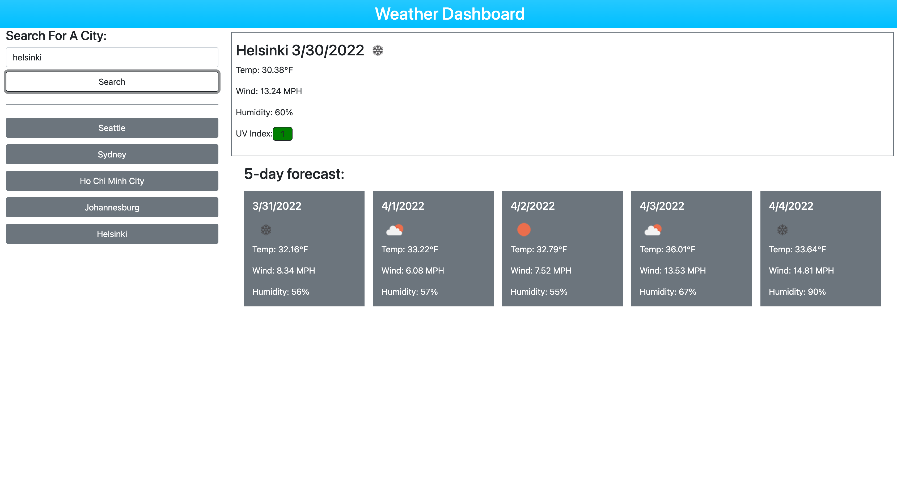

[#Homework Week VI Weather Dashboard](https://rkutsel.github.io/js-weather-dashboard/)

For this assignment I used
[Bootstrap](https://getbootstrap.com/docs/5.1/getting-started/introduction/) to
style my HTML, considered using [Moment.js](https://momentjs.com) to do time
conversion, but didn't feel like doing it cause there's not much outside of
converting Unix timestamps so I went for good ole `Date()` so that removed an
unnecessary dependency.  
Bootstrap took care of most of the styling/content positioning with a few custom
CSS definitions of my own. The end result meets the user story objectives. In
the process made a decision to make a sort of short cut to store items locally.
Rather than storing all items && its content, I made a decision to limit local
storage to the city name and let JS async do its network magic ;) It seems like
a reasonable compromise and I obviously wouldn't have chosen that path if it was
prohibited by the specs.
[live page](https://rkutsel.github.io/js-weather-dashboard/).

## Additional Notes

Even though this deliverable meets the MVP specs, I was thinking of adding a few
more features that would make it a little bit more user-friendly. Plan on
tackling those in the near future.

- [x] Prevent dup items in the favorite list so that I can't add the same city
      more than once. Fixed in
      [d577226](https://github.com/rkutsel/js-weather-dashboard/commit/d57722621d69105eed78e980aa4702f48e4946f3)
- [ ] Have a way control the max number of items in the list. Maybe limit it to
      10 items which seems to be reasonable.
- [ ] Add another button beneath the favorite list items that would clear them
      all.
- [ ] Ability to remove individual items from the menu. This one is probably
      going to be tricky to tackle as it would require major changes for both
      CSS && JS.

## User Story

```
AS A traveler
I WANT to see the weather outlook for multiple cities
SO THAT I can plan a trip accordingly
```

## Acceptance Criteria

```
GIVEN a weather dashboard with form inputs
WHEN I search for a city
THEN I am presented with current and future conditions for that city and that city is added to the search history
WHEN I view current weather conditions for that city
THEN I am presented with the city name, the date, an icon representation of weather conditions, the temperature, the humidity, the wind speed, and the UV index
WHEN I view the UV index
THEN I am presented with a color that indicates whether the conditions are favorable, moderate, or severe
WHEN I view future weather conditions for that city
THEN I am presented with a 5-day forecast that displays the date, an icon representation of weather conditions, the temperature, the wind speed, and the humidity
WHEN I click on a city in the search history
THEN I am again presented with current and future conditions for that city
```

## My Own Mock-UP



## User Story Mock-Up


